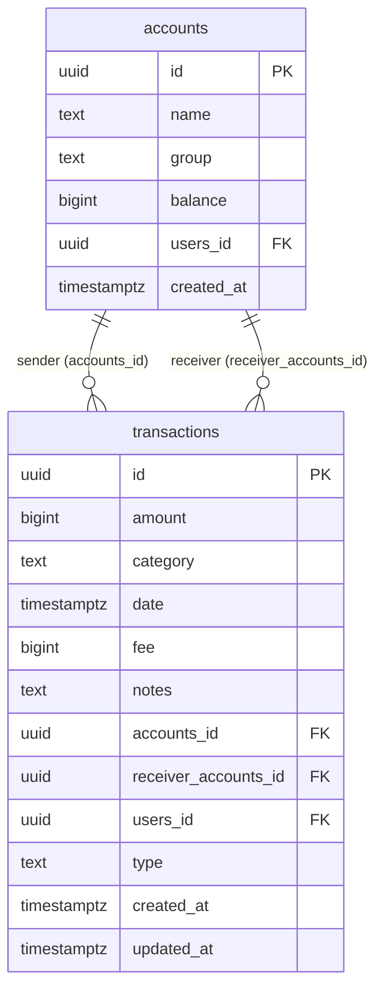

# feat: Implement Offline-First Architecture with PowerSync

**Type:** Enhancement (Major)
**Date:** 2026-02-26
**Complexity:** High
**Affected Platforms:** Android, iOS, Desktop (JVM). JS/WasmJS remain online-only.

---

## Overview

Integrate PowerSync into Cofinance to enable offline-first data access. Currently the app has **zero local storage** -- every read/write goes directly to Supabase Postgrest. If the network is unavailable, the app is non-functional. PowerSync will add a local SQLite database that syncs bidirectionally with Supabase, making all reads instant and all writes available offline.

## Problem Statement

1. **No offline capability** -- App crashes or shows empty screens without network
2. **Slow reads** -- Every data fetch requires a network round-trip
3. **No reactive updates** -- Data doesn't auto-refresh when changed elsewhere
4. **Fragile balance updates** -- Client-side read-modify-write pattern creates race conditions even online
5. **Non-atomic transfers** -- 3 separate network calls with no transaction semantics

## Proposed Solution

Replace direct Supabase Postgrest calls with PowerSync local SQLite database for `accounts` and `transactions` tables. Keep Supabase Auth and Storage as-is (they require network by nature).

### Architecture After Implementation

```
┌──────────────────────────────────────────────────┐
│              UI Layer (Compose)                    │
│   ViewModels collect Flow<List<T>> from repos     │
├──────────────────────────────────────────────────┤
│            Domain Layer (Use Cases)                │
│    Mostly unchanged -- returns Flow<ResultState>   │
├──────────────────────────────────────────────────┤
│          Repository Layer (Modified)               │
│   Reads: SQL queries on local PowerSync SQLite     │
│   Writes: SQL inserts/updates on local SQLite      │
│   Watch: database.watch() returns reactive Flow    │
├──────────────────────────────────────────────────┤
│      PowerSync Database + Supabase Connector       │
│   Schema, connector (fetchCredentials, uploadData) │
├──────────────────────────────────────────────────┤
│           PowerSync Cloud Service                  │
│   Logical replication from Supabase Postgres       │
├──────────────────────────────────────────────────┤
│              Supabase (Postgres)                   │
│   Source of truth, RLS policies, auth              │
└──────────────────────────────────────────────────┘
```

---

## Technical Approach

### Pre-Requisite: Backend Changes (Supabase)

Before any client work, these server-side changes are required:

#### P1. Create PowerSync publication

```sql
CREATE PUBLICATION powersync FOR TABLE accounts, transactions;
```

#### P2. Create `adjust_balance` RPC function

Eliminates the unsafe client-side read-modify-write pattern:

```sql
CREATE OR REPLACE FUNCTION adjust_balance(p_account_id UUID, p_delta BIGINT)
RETURNS void AS $$
BEGIN
  UPDATE accounts SET balance = balance + p_delta WHERE id = p_account_id;
END;
$$ LANGUAGE plpgsql SECURITY DEFINER;
```

#### P3. Create `execute_transfer` RPC function

Atomic transfer operation:

```sql
CREATE OR REPLACE FUNCTION execute_transfer(
  p_transaction_id UUID,
  p_sender_id UUID,
  p_receiver_id UUID,
  p_amount BIGINT,
  p_fee BIGINT,
  p_category TEXT,
  p_notes TEXT,
  p_date TIMESTAMPTZ,
  p_user_id UUID
) RETURNS void AS $$
BEGIN
  INSERT INTO transactions (id, amount, category, date, fee, notes, accounts_id, receiver_accounts_id, users_id, type, created_at, updated_at)
  VALUES (p_transaction_id, p_amount, p_category, p_date, p_fee, p_notes, p_sender_id, p_receiver_id, p_user_id, 'TRANSFER', NOW(), NOW())
  ON CONFLICT (id) DO NOTHING;

  UPDATE accounts SET balance = balance - p_amount - p_fee WHERE id = p_sender_id;
  UPDATE accounts SET balance = balance + p_amount WHERE id = p_receiver_id;
END;
$$ LANGUAGE plpgsql SECURITY DEFINER;
```

#### P4. Configure PowerSync Cloud Dashboard

- Connect to Supabase Postgres
- Enable Supabase Auth JWT validation
- Deploy sync rules:

```yaml
bucket_definitions:
  user_accounts:
    priority: 1
    parameters: SELECT request.user_id() as user_id
    data:
      - SELECT * FROM accounts WHERE users_id = bucket.user_id

  user_transactions:
    priority: 2
    parameters: SELECT request.user_id() as user_id
    data:
      - SELECT * FROM transactions WHERE users_id = bucket.user_id
```

#### P5. Add `POWERSYNC_URL` to `local.properties`

```properties
powersync.url=https://YOUR_INSTANCE.powersync.journeyapps.com
```

---

### Implementation Phases

#### Phase 1: Foundation (PowerSync Infrastructure)

No user-visible changes. Add PowerSync alongside existing code.

**1.1 Add Gradle dependencies**

File: `gradle/libs.versions.toml`

```toml
[versions]
powersync = "1.10.4"

[libraries]
powersync-core = { module = "com.powersync:core", version.ref = "powersync" }
powersync-compose = { module = "com.powersync:powersync-compose", version.ref = "powersync" }
powersync-connector-supabase = { module = "com.powersync:connector-supabase", version.ref = "powersync" }
```

File: `composeApp/build.gradle.kts`

```kotlin
commonMain.dependencies {
    implementation(libs.powersync.core)
    implementation(libs.powersync.compose)
    implementation(libs.powersync.connector.supabase)
}
```

Add BuildKonfig field for PowerSync URL.

**Important:** PowerSync does NOT support JS/WasmJS targets. Add PowerSync dependencies only for Android, iOS, and Desktop source sets, OR use `expect`/`actual` to provide a no-op implementation for web targets.

**1.2 Define PowerSync schema**

New file: `composeApp/src/commonMain/kotlin/id/andriawan/cofinance/data/powersync/CofinanceSchema.kt`

```kotlin
val CofinanceSchema = Schema(
    listOf(
        Table(
            name = "accounts",
            columns = listOf(
                Column.text("name"),
                Column.text("group"),
                Column.integer("balance"),
                Column.text("users_id"),
                Column.text("created_at")
            ),
            indexes = listOf(
                Index("idx_accounts_user", listOf(IndexedColumn.ascending("users_id")))
            )
        ),
        Table(
            name = "transactions",
            columns = listOf(
                Column.integer("amount"),
                Column.text("category"),
                Column.text("date"),
                Column.integer("fee"),
                Column.text("notes"),
                Column.text("accounts_id"),
                Column.text("receiver_accounts_id"),
                Column.text("type"),
                Column.text("users_id"),
                Column.text("created_at"),
                Column.text("updated_at")
            ),
            indexes = listOf(
                Index("idx_tx_date", listOf(IndexedColumn.descending("date"))),
                Index("idx_tx_user", listOf(IndexedColumn.ascending("users_id"))),
                Index("idx_tx_account", listOf(IndexedColumn.ascending("accounts_id")))
            )
        )
    )
)
```

Notes:
- `id` column is auto-created by PowerSync -- do NOT declare it
- Only `text`, `integer`, `real` types available
- Column names must match Supabase Postgres column names exactly

**1.3 Create Supabase connector for PowerSync**

New file: `composeApp/src/commonMain/kotlin/id/andriawan/cofinance/data/powersync/CofinanceConnector.kt`

The connector must:
- `fetchCredentials()`: Return Supabase JWT access token + PowerSync endpoint URL
- `uploadData()`: Process CRUD queue entries, routing writes to Supabase

Upload strategy per operation type:
- **EXPENSE/INCOME transactions**: INSERT transaction + call `adjust_balance` RPC (not absolute write)
- **TRANSFER transactions**: Call `execute_transfer` RPC (single atomic server operation)
- **Account CRUD**: Standard upsert/update/delete via Postgrest
- **Fatal errors** (4xx except 429): Complete transaction to discard bad data
- **Retryable errors** (5xx, network): Re-throw to let PowerSync retry

**1.4 Register in Koin DI**

File: `composeApp/src/commonMain/kotlin/id/andriawan/cofinance/di/NetworkModule.kt`

Add:
- `PowerSyncDatabase` singleton (schema + db filename)
- `CofinanceConnector` singleton (inject SupabaseClient + PowerSync URL)

---

#### Phase 2: Migrate Read Operations

Switch repositories from direct Supabase reads to local PowerSync SQL queries, one table at a time.

**2.1 Create a PowerSync local data source**

New file: `composeApp/src/commonMain/kotlin/id/andriawan/cofinance/data/datasource/PowerSyncDataSource.kt`

This class wraps `PowerSyncDatabase` and provides typed read methods:

```kotlin
class PowerSyncDataSource(private val database: PowerSyncDatabase) {

    fun watchAccounts(userId: String): Flow<List<AccountResponse>> {
        return database.watch(
            sql = "SELECT * FROM accounts WHERE users_id = ? ORDER BY created_at DESC",
            parameters = listOf(userId)
        ) { cursor ->
            AccountResponse(
                id = cursor.getString("id"),
                name = cursor.getString("name"),
                group = cursor.getString("group"),
                balance = cursor.getLong("balance"),
                createdAt = cursor.getString("created_at")
            )
        }
    }

    fun watchTransactions(userId: String, month: Int?, year: Int?): Flow<List<TransactionResponse>> {
        // SQL query with local JOINs for sender/receiver accounts
        // (replaces Supabase relationship embedding)
    }

    suspend fun getAccounts(userId: String): List<AccountResponse> {
        return database.getAll(
            sql = "SELECT * FROM accounts WHERE users_id = ? ORDER BY created_at DESC",
            parameters = listOf(userId)
        ) { cursor -> /* same mapping */ }
    }
}
```

**Key change:** Supabase's relationship embedding (`sender:transactions_accounts_id_fkey(*)`) is not available in SQLite. Replace with local SQL JOINs:

```sql
SELECT t.*,
    sa.name as sender_name, sa.group as sender_group, sa.balance as sender_balance,
    ra.name as receiver_name, ra.group as receiver_group, ra.balance as receiver_balance
FROM transactions t
LEFT JOIN accounts sa ON t.accounts_id = sa.id
LEFT JOIN accounts ra ON t.receiver_accounts_id = ra.id
WHERE t.users_id = ?
ORDER BY t.date DESC
```

**2.2 Update `AccountRepositoryImpl`**

File: `composeApp/src/commonMain/kotlin/id/andriawan/cofinance/data/repository/AccountRepository.kt`

- Change `getAccounts()` to read from `PowerSyncDataSource` instead of `SupabaseDataSource`
- Add `watchAccounts(): Flow<List<Account>>` for reactive UI updates

**2.3 Update `TransactionRepositoryImpl`**

File: `composeApp/src/commonMain/kotlin/id/andriawan/cofinance/data/repository/TransactionRepository.kt`

- Change `getTransactions()` to read from `PowerSyncDataSource`
- Add `watchTransactions(): Flow<List<Transaction>>` for reactive UI updates
- Handle the JOIN mapping in Kotlin (map flat cursor rows to Transaction domain models with nested Account objects)

**2.4 Update Use Cases to use Flow-based reads**

Existing use cases return `Flow<ResultState<T>>` via `flow { emit(Loading); emit(Success(repo.getData())) }`. With PowerSync watched queries, the pattern changes to:

```kotlin
class GetAccountsUseCase(private val accountRepository: AccountRepository) {
    fun execute(): Flow<ResultState<List<Account>>> {
        return accountRepository.watchAccounts()
            .map<List<Account>, ResultState<List<Account>>> { ResultState.Success(it) }
            .onStart { emit(ResultState.Loading) }
            .catch { emit(ResultState.Error(it as Exception)) }
    }
}
```

---

#### Phase 3: Migrate Write Operations

Switch repositories from direct Supabase writes to local PowerSync SQL writes.

**3.1 Update `AccountRepositoryImpl` writes**

- `addAccount()`: INSERT into local SQLite with client-generated UUID (`kotlin.uuid.Uuid.random().toString()`)
- Remove `reduceAmount()` / `increaseAmount()` direct calls -- balance changes happen through the connector's `uploadData()` calling `adjust_balance` RPC

**3.2 Update `TransactionRepositoryImpl` writes**

- `createTransaction()`: INSERT into local SQLite with client-generated UUID
- The connector's `uploadData()` handles routing to either direct Postgrest or RPC depending on transaction type

**3.3 Refactor `CreateTransactionUseCase`**

File: `composeApp/src/commonMain/kotlin/id/andriawan/cofinance/domain/usecases/transactions/CreateTransactionUseCase.kt`

Current flow (3 separate calls):
1. `createTransaction()` -> Supabase INSERT
2. `reduceBalance()` or `increaseBalance()` -> Supabase SELECT + UPDATE
3. (For transfers) `increaseBalance()` -> Supabase SELECT + UPDATE

New flow (single local write):
1. `createTransaction()` -> Local SQLite INSERT (PowerSync queues for upload)
2. Balance update handled atomically server-side via `adjust_balance` or `execute_transfer` RPC in the connector

The use case simplifies to just creating the transaction record locally. The connector's `uploadData()` is responsible for calling the appropriate server-side function.

---

#### Phase 4: Sync Lifecycle & Auth Integration

**4.1 Connect PowerSync after authentication**

File: `composeApp/src/commonMain/kotlin/id/andriawan/cofinance/pages/splash/SplashViewModel.kt` (or equivalent auth flow)

After successful login:
```kotlin
database.connect(connector)
```

On logout:
```kotlin
database.disconnectAndClear()
```

**4.2 Fix startup flow for offline returning users**

Current: `SplashScreen` calls `fetchUser()` (network) -> failure sends to Login.

New flow:
1. Check if PowerSync has a local session (`database.currentStatus.hasSynced`)
2. If yes -> Navigate to Main (offline mode). Attempt background token refresh.
3. If no -> Attempt network auth. On success -> connect PowerSync -> Navigate to Main. On failure -> Navigate to Login.

**4.3 Handle token expiry**

PowerSync automatically calls `fetchCredentials()` when the token expires. The connector should:
1. Call `supabaseClient.auth.refreshCurrentSession()` to get a new access token
2. Return the refreshed token in `PowerSyncCredentials`
3. If refresh fails (refresh token also expired) -> emit an event to redirect to Login

**4.4 Handle logout with pending uploads**

Before calling `database.disconnectAndClear()`:
1. Check `SELECT COUNT(*) FROM ps_crud` for pending uploads
2. If count > 0, show confirmation dialog: "You have X unsynced changes. Logging out will discard them."
3. If user confirms, proceed with `disconnectAndClear()`

---

#### Phase 5: Sync Status UI

**5.1 Create sync status model**

New file: `composeApp/src/commonMain/kotlin/id/andriawan/cofinance/domain/model/response/SyncState.kt`

```kotlin
sealed class SyncState {
    data object Synced : SyncState()
    data object Syncing : SyncState()
    data object Offline : SyncState()
    data class Error(val pendingCount: Long) : SyncState()
}
```

**5.2 Add sync status to MainViewModel or shared app state**

Expose `database.currentStatus` as a `Flow<SyncState>` that maps PowerSync's internal status to the domain model.

**5.3 Add sync indicator to UI**

Add a small indicator to the main screen (e.g., in the top bar or bottom navigation area) showing:
- Green dot: Synced
- Spinning: Syncing
- Orange dot: Offline (but has local data)
- Red badge with count: Failed uploads

---

#### Phase 6: Cleanup & Platform Handling

**6.1 Remove unused Supabase data methods**

File: `composeApp/src/commonMain/kotlin/id/andriawan/cofinance/data/datasource/SupabaseDataSource.kt`

Remove: `getAccounts()`, `addAccount()`, `increaseBalance()`, `reduceBalance()`, `getTransactions()`, `createTransaction()`

Keep: `getUser()`, `fetchUser()`, `login()`, `logout()`, `uploadAvatar()`, `updateUserMetadata()` (auth + storage)

**6.2 Handle JS/WasmJS targets**

PowerSync does not support web targets. Two options:

**Option A (Recommended):** Use `expect`/`actual` pattern. Create an interface `DataSource` with platform-specific implementations:
- Android/iOS/Desktop: `PowerSyncDataSource` (offline-first)
- JS/WasmJS: `SupabaseDataSource` (online-only, keep existing code)

**Option B:** Drop JS/WasmJS targets for now (if web is not a priority).

**6.3 iOS-specific setup**

Add `powersync-sqlite-core-swift` SPM dependency to the iOS Xcode project. Ensure the framework is static (already the case in your project: `isStatic = true`).

**6.4 Remove unused Supabase Realtime dependency**

File: `composeApp/build.gradle.kts`

Remove `supabasekt-realtime` -- PowerSync's `watch()` replaces the need for Realtime subscriptions.

---

## Files Changed Summary

| File | Action | Description |
|------|--------|-------------|
| `gradle/libs.versions.toml` | Modify | Add PowerSync version + library declarations |
| `composeApp/build.gradle.kts` | Modify | Add PowerSync dependencies, add BuildKonfig field |
| `local.properties` | Modify | Add `powersync.url` |
| `data/powersync/CofinanceSchema.kt` | **Create** | PowerSync local schema definition |
| `data/powersync/CofinanceConnector.kt` | **Create** | Supabase connector with uploadData logic |
| `data/datasource/PowerSyncDataSource.kt` | **Create** | Local read methods (getAll, watch) |
| `data/datasource/SupabaseDataSource.kt` | Modify | Remove data table methods, keep auth/storage |
| `data/repository/AccountRepository.kt` | Modify | Add `watchAccounts()`, switch reads to PowerSync |
| `data/repository/AccountRepositoryImpl.kt` | Modify | Implement PowerSync reads/writes |
| `data/repository/TransactionRepository.kt` | Modify | Add `watchTransactions()`, switch reads to PowerSync |
| `data/repository/TransactionRepositoryImpl.kt` | Modify | Implement PowerSync reads/writes, local JOINs |
| `di/NetworkModule.kt` | Modify | Register PowerSyncDatabase + Connector |
| `domain/usecases/transactions/CreateTransactionUseCase.kt` | Modify | Simplify to single local write |
| `domain/usecases/accounts/GetAccountsUseCase.kt` | Modify | Use Flow-based watched query |
| `domain/usecases/transactions/GetTransactionsUseCase.kt` | Modify | Use Flow-based watched query |
| `domain/usecases/transactions/GetTransactionsGroupByMonthUseCase.kt` | Modify | Use Flow-based watched query |
| `domain/usecases/accounts/GetBalanceStatsUseCase.kt` | Modify | Use Flow-based watched query |
| `domain/model/response/SyncState.kt` | **Create** | Sync status domain model |
| `pages/splash/SplashViewModel.kt` | Modify | Add offline session check |
| `pages/main/MainScreen.kt` or `MainViewModel` | Modify | Add sync status indicator |
| `pages/profile/ProfileViewModel.kt` | Modify | Add pending upload check before logout |
| ViewModels (all data-displaying) | Modify | Collect watched Flows instead of one-shot fetches |

---

## Acceptance Criteria

### Functional Requirements

- [ ] App displays cached accounts and transactions when offline (returning user)
- [ ] User can create accounts while offline; they sync when online
- [ ] User can create expense/income transactions while offline; they sync when online
- [ ] User can create transfer transactions while offline; they sync atomically when online
- [ ] Balances are updated correctly even with concurrent edits from multiple devices
- [ ] Data auto-refreshes in the UI when changes sync from the server
- [ ] Sync status is visible to the user (synced/syncing/offline/error)
- [ ] Logout warns about pending unsynced changes
- [ ] Token refresh works transparently when returning online after extended offline period
- [ ] First-time user sees "Syncing..." indicator during initial data load

### Non-Functional Requirements

- [ ] All reads are local (no network required after initial sync)
- [ ] Write operations complete instantly (local) regardless of network state
- [ ] PowerSync database is a singleton (no "database is locked" errors)
- [ ] JS/WasmJS targets still compile and work (online-only fallback)
- [ ] iOS builds successfully with `powersync-sqlite-core-swift` SPM dependency

---

## Risk Analysis & Mitigation

| Risk | Likelihood | Impact | Mitigation |
|------|-----------|--------|------------|
| Balance corruption from concurrent edits | High | Critical | Server-side `adjust_balance` RPC with delta-based updates |
| Transfer partial failure | Medium | Critical | Server-side `execute_transfer` atomic RPC |
| PowerSync SDK incompatible with Kotlin 2.3.0 | Low | High | Check compatibility before starting; pin to known-good version |
| JS/WasmJS build breaks | Medium | Medium | Use `expect`/`actual` to exclude PowerSync from web targets |
| Upload queue ordering issues | Medium | Medium | PowerSync processes CRUD entries in order; test account-then-transaction flow |
| Token expiry after long offline period | Medium | Low | Connector's `fetchCredentials` handles refresh; graceful fallback to login |

---

## Dependencies

- PowerSync Cloud account (free tier available)
- Supabase database admin access (to create publication + RPC functions)
- iOS: Xcode SPM configuration for `powersync-sqlite-core-swift`

---

## ERD (Current Schema, No Model Changes Needed)



---

## References

### Internal
- `composeApp/src/commonMain/kotlin/id/andriawan/cofinance/data/datasource/SupabaseDataSource.kt` -- Current data access
- `composeApp/src/commonMain/kotlin/id/andriawan/cofinance/domain/usecases/transactions/CreateTransactionUseCase.kt` -- Balance update logic
- `composeApp/src/commonMain/kotlin/id/andriawan/cofinance/di/NetworkModule.kt` -- DI configuration
- `composeApp/src/commonMain/kotlin/id/andriawan/cofinance/pages/splash/SplashScreen.kt` -- Auth startup flow

### External
- [PowerSync Kotlin SDK Docs](https://docs.powersync.com/client-sdk-references/kotlin-multiplatform)
- [PowerSync + Supabase Integration Guide](https://docs.powersync.com/integration-guides/supabase-+-powersync)
- [PowerSync Kotlin SDK GitHub](https://github.com/powersync-ja/powersync-kotlin)
- [PowerSync Supabase Todo Demo](https://github.com/powersync-ja/powersync-kotlin/tree/main/demos/supabase-todolist)
- [PowerSync Sync Rules](https://docs.powersync.com/usage/sync-rules)
- [PowerSync Conflict Resolution](https://docs.powersync.com/handling-writes/custom-conflict-resolution)
- [PowerSync Production Readiness Guide](https://docs.powersync.com/resources/production-readiness-guide)
- [Supabase Connector Performance](https://docs.powersync.com/tutorials/client/performance/supabase-connector-performance)
